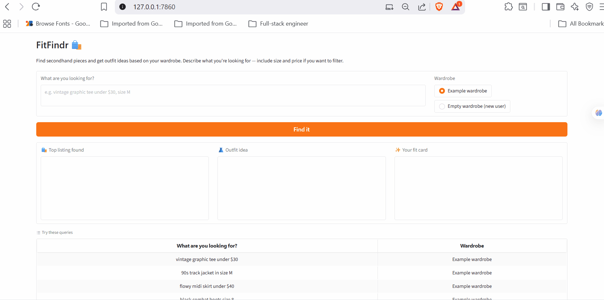
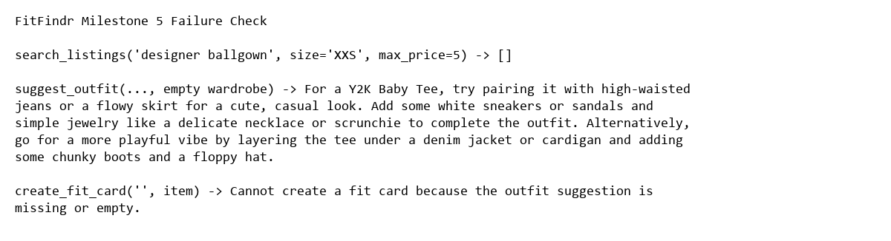

# FitFindr — Starter Kit

This starter kit contains everything you need to begin Project 2.

## What's Included

```
ai201-project2-fitfindr-starter/
├── agent.py                   # Planning loop orchestrating the three tools
├── app.py                     # Gradio interface for FitFindr
├── tools.py                   # Implementation of search_listings, suggest_outfit, create_fit_card
├── data/
│   ├── listings.json          # 40 mock secondhand listings
│   └── wardrobe_schema.json   # Wardrobe format + example wardrobe
├── utils/
│   └── data_loader.py         # Helper functions for loading the data
├── planning.md                # Project planning and tool specifications
└── requirements.txt           # Python dependencies
```

## Setup

```bash
pip install -r requirements.txt
```

Set your Groq API key in a `.env` file (get a free key at [console.groq.com](https://console.groq.com)):

```
GROQ_API_KEY=your_key_here
```

## The Mock Listings Dataset

`data/listings.json` contains 40 mock secondhand listings across categories (tops, bottoms, outerwear, shoes, accessories) and styles (vintage, y2k, grunge, cottagecore, streetwear, and more).

Each listing has: `id`, `title`, `description`, `category`, `style_tags`, `size`, `condition`, `price`, `colors`, `brand`, and `platform`.

Load it with:

```python
from utils.data_loader import load_listings
listings = load_listings()
```

## The Wardrobe Schema

`data/wardrobe_schema.json` defines the format your agent uses to represent a user's existing wardrobe. It includes:

- `schema`: field definitions for a wardrobe item
- `example_wardrobe`: a sample wardrobe with 10 items you can use for testing
- `empty_wardrobe`: a starting template for a new user

Load an example wardrobe with:

```python
from utils.data_loader import get_example_wardrobe
wardrobe = get_example_wardrobe()
```

## Running the Application

Once implementation is complete, start the Gradio web interface:

```bash
python app.py
```

Then open the localhost URL shown in your terminal (usually `http://localhost:7860`).

To test the agent directly in Python:

```python
from agent import run_agent
from utils.data_loader import get_example_wardrobe

result = run_agent(
    query="vintage graphic tee under $30, size M",
    wardrobe=get_example_wardrobe(),
)
print(result["fit_card"])
print(result["error"])
```

## Tool Inventory

| Tool                                             | Inputs                                                   | Outputs                    | Purpose                                                                                                                     |
| ------------------------------------------------ | -------------------------------------------------------- | -------------------------- | --------------------------------------------------------------------------------------------------------------------------- | ----------------------------------------------------- | ---------------------------------------------------------------------------------------------------- |
| `search_listings(description: str, size: str     | None, max_price: float                                   | None)`                     | `description`, optional `size`, optional `max_price`                                                                        | `list[dict]` of matching listings sorted by relevance | Find the best secondhand listings from the mock dataset and return an empty list if nothing matches. |
| `suggest_outfit(new_item: dict, wardrobe: dict)` | `new_item` listing dict and `wardrobe` dict with `items` | `str` outfit suggestions   | Generate 1-2 outfit ideas using the selected item and the user’s wardrobe, or give general advice if the wardrobe is empty. |
| `create_fit_card(outfit: str, new_item: dict)`   | `outfit` text and `new_item` dict                        | `str` social-ready caption | Turn the outfit idea into a short OOTD-style caption that mentions the item, price, and platform naturally.                 |

## Planning Loop

The agent does not call all tools blindly. It follows a small loop in `agent.py`:

1. Read the user query and parse out the description, size, and max price.
2. Call `search_listings()` with those parsed values.
3. If no listings come back, stop immediately and store a helpful error message in `session["error"]`.
4. If a listing is found, store the top result in `session["selected_item"]`.
5. Pass that exact item into `suggest_outfit()` along with the wardrobe.
6. Pass the outfit text into `create_fit_card()` with the same selected item.
7. Return the full session dict so the UI can display every step.

This makes the behavior conditional: a no-results query ends early, while a successful query continues through outfit and caption generation.

## State Management

FitFindr keeps one session dictionary for the whole interaction. That dictionary stores the parsed query, the search results, the selected item, the wardrobe, the outfit suggestion, the fit card, and any error message.

The important part is that data flows forward instead of being re-entered:

- `session["search_results"][0]` becomes `session["selected_item"]`
- `session["selected_item"]` is passed into `suggest_outfit()`
- the returned outfit string becomes `session["outfit_suggestion"]`
- that outfit string is passed into `create_fit_card()`

That is why the same item and outfit can be traced across the app, the CLI output, and the demo.

## Error Handling

Each tool has its own graceful failure path.

- `search_listings()` returns `[]` when nothing matches. Example from testing: `designer ballgown size XXS under $5` returns no results, and the agent responds with a helpful message telling the user to loosen the query.
- `suggest_outfit()` still returns styling advice if the wardrobe is empty. Example from testing: using an empty wardrobe with a vintage graphic tee still produced general outfit guidance instead of crashing.
- `create_fit_card()` returns a readable error string if the outfit text is empty. Example from testing: calling it with `""` returns `Cannot create a fit card because the outfit suggestion is missing or empty.`

The agent itself also stops early on no-results queries so it does not call later tools with invalid input.

## AI Usage

I used AI in a few specific places, then adjusted the result to match the project rules and tests.

1. For the tool implementations, I gave the AI the `search_listings`, `suggest_outfit`, and `create_fit_card` spec blocks from `planning.md` plus the docstrings in `tools.py`. It produced working function drafts. I kept the basic structure but changed details like the empty-wardrobe guard, the empty-outfit guard, and the test-friendly temperature values.
2. For the planning loop, I gave the AI the Planning Loop, State Management, and Architecture sections from `planning.md` plus the TODOs in `agent.py` and `app.py`. It produced a session-driven loop and Gradio handler draft. I overrode the query parsing strategy and used regex in code instead of the earlier LLM JSON-mode idea because it was simpler to test and easier to keep deterministic.

## Spec Reflection

The spec was useful as a design guide, but a few implementation choices were simplified for reliability.

- The planning document originally described an LLM-based parse step, but the code uses regex parsing so the inputs are predictable and easy to test.
- The planning document also included a stretch `compare_price` tool, but the core project flow is already complete without it, so I kept the README focused on the three required tools.
- The error-handling behavior in the spec matches the actual implementation and the tests, which made it easy to verify the checkpoint.

## Demo And Evidence

The recorded interaction demo is shown below.



The milestone 5 triggered-failure capture is shown below.



The failure screenshot shows:

- `search_listings()` returning an empty list for an impossible query,
- `suggest_outfit()` producing general styling advice for an empty wardrobe,
- and `create_fit_card()` returning a descriptive error for a blank outfit string.

## Where to Start

1. **Read `planning.md` and fill it out before writing any code.**
2. Verify the data loads correctly by running `python utils/data_loader.py`.
3. Build and test each tool individually before connecting them through your planning loop.

Your implementation files go in this same directory. There's no required file structure for your agent code — organize it however makes sense for your design.
